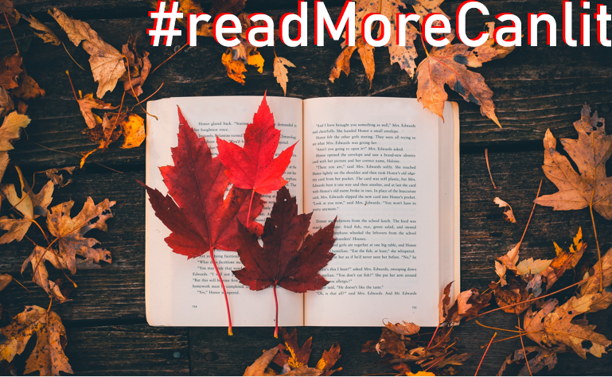
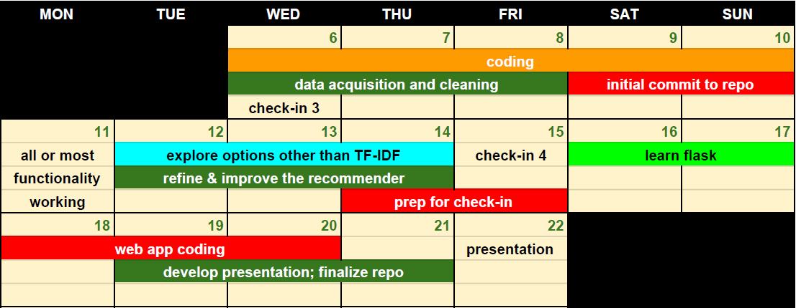

# #readMoreCanlit

> Shawn Syms 
> https://shawnsyms.github.io/  
> shawn@shawnsyms.com  
> 416-843-4169  

## Overview

**#readMoreCanlit** will be a content-based recommender system that promotes the reading of Canadian literature. 

According to a recent survey by the non-profit organization BookNetCanada, 92% percent of Canadians had read a paper copy of a book, and use of e-reading devices had increased by 25% over the previous year. Still, the Canadian best-seller lists tend to be dominated by American and international titles. 

#readMoreCanlit could serve as part of a consolidated marketing program to promote reading Canadian literature. Future phases could include a purchasing engine.

---

## Problem statement

I will build a content-based recommender system that accepts input from readers and makes appropriate recommendations from a curated list of Canadian books: 

* The user should be able to provide the name of a book they like (or dislike) 
* Or they can select one from a list of 5-10 titles that the system already knows about
* The user should be able to input a freeform sentence about their reading interests.

The baseline for comparison could be whether or not the system can make recommendations that are better than random guessing, which can be assessed through domain knowledge as well as whether the recommendations are in the same genre. I will engage in testing with my peers to assess effectiveness.

Initial testing suggests that the model actually makes very good recommendations.

## Progress report

**1. Data acquisition:** Status, constraints, limitations

The international categorization standard for books is **ISBN-13** (for International Standard Book Number), a 13-digit code (for example, 9781551525709). An ISBN identifies a book, its publisher and its location of publication geographically. IBSN numbers are mathematically calculated. All published books have ISBN numbers, and there is no way to sort for quality or popularity via the number. 

In terms of further details about a book, the international standard for representing and communicating product information electronically is called **ONIX.** ONIX is an XML-based standard for encoding metadata about books. 

One way to access ONIX data online is through the Book Net Canada (BNC) service **Catalist,** and the BNC API. Another way to access some book data, such as a description, is through the **ISBNdb.com** API. There are also many lookup sites that will exchange an ISBN number for book metadata.

In order use either of these services, you need to already know a book's ISBN number. There are not many resources to look up ISBNs; it usually works the other way around (enter an ISBN, get the book data). An example exception would be to manually look-up books on Amazon. I did that for the first 300 books, but that's not scalable. 

On the websites data.planet and datahub.io, I was able to find large repositories of ISBN numbers with no data associated to them, often originating in public libraries. These datasets feature anywhere from 1,000 to 101,000 ISBN numbers.

I have been using the ISBNdb API to iterate through the ISBN numbers (subject to daily limits), and pull the information that I need: author, title, description (I've also been pulling image URLs for books in case I can use them in the webapp). The most important feature is description, since that is what the recommender is vectorizing and comparing. The challenge is that the vast majority of the books don't have descriptions. 

Our agreed-upon objective for data size is a minimum of 500-1,000 Canadian titles and a minimum of 5,000 international titles. I can do it, and have made decent progress. 

Out of around 17,000 books, I have identified 3,210 international titles for the dataset. I'm going to continue, but it has been slow going. I need to manually review the titles as well for appropriateness (for instance, an English-Spanish dictionary has an ISBN number, but it's not a piece of literature, it's a reference text). I also manually created an initial dataset of 400 for a total of 3,610. I believe that reaching a total of 5,000 titles should not be a problem (possibly 10,000). The process is mostly automated but requires some manual intervention, and is subject to daily limits.

Through scraping content from a Canadian specialist website called 49thshelf.com, I have identified 8,860 Canadian fiction titles. I have all details for these books except the necessary description. I need to write another script to grab those. I expect that most of these books will have descriptions. I also have scraped information on another 200 Canadian non-fiction site from another specialist site called livrescanadabooks.com, and there are more titles I can grab from there. I also plan to do some additional ISBN lookups using the BNC Catalist API if I can identify more Canadian ISBNs. I've built a calculator that will validate ISBN numbers, but trying to make them up and validate them is pretty time consuming and can yield unpredictable results, so that has not been the focus. At any rate, there's a little more work to be done, but progress is happening daily. 

All the data needs some level of cleaning. The IBSNdb data is the dirtiest and there will be lots of preprocessing required, which I hope to start in the next day. The non-fiction Canadian list came with the author as part of the description field, so that will need to be extracted. As the formats for the data are fairly standard, most of this will be automatable. 

Once the data is clean, the title, author, and origin features will be concatenated with the description feature so that all of it can be vectorized.

**2. Exploratory Data Analysis:** Thorough EDA of the consolidated dataset is pending, however I have been closely examining the data as it comes in, as input to my scripts and input into the application design. I should be in a place to do proper EDA in a few days, and then start working on the front end.

**3. Modeling:** Status and results

I have built a very simple recommender engine using TF-IDF vectorizer (so that words are denoted as distinctive if they appear commonly in a document versus in the entire corpus), calculating cosine similarity using the linear kernel. Initial testing shows the recommender to be very effective. My next step will be to distinguish the results between Canadian content and international content. 

**4. Barriers** and necessary support

The main barrier is adequate data acquisition and preprocessing. As well, it is a stretch for my coding capabilities, so I am teaching myself as I go. 

**5. Proposed timeline**

- **6. Requested discussion topics for 1:1** 
- I will mostly want some suggestions about coding various aspects of the system, as well as some insights about different approaches to a content-based recommender.

