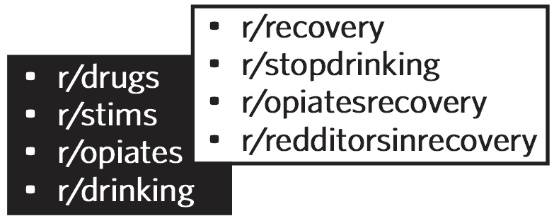
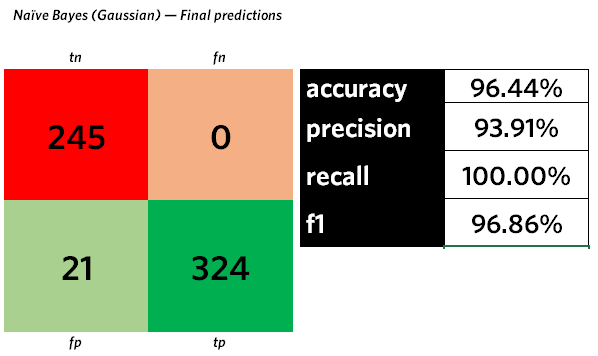

# Training a binary classifier for reddit posts using Natural Language Processing (NLP) 

### Executive summary
* <a href="#executive_summary">Executive summary</a>
* <a href="#problem_statement">Problem statement</a>
* <a href="#models">Models</a>
* <a href="#results">Results</a>
* <a href="#recommendations">Recommendations</a>

# Executive summary

<em>What if you could tell, scientifically, where your clients are in the substance-use recovery lifecycle based on their  writing?</em>

It's rewarding, but challenging, to run recovery initiatives for people who want to control their problem alcohol and drug use, whether we are talking about inpatient or outpatient rehabilitation, or supervised injection sites with on-site access to treatment, counselling or support. Reviewing the thoughts and feelings of patients and clients, sometimes through their creative output, can be one part of the recovery process. 

In counselling, clients are not always truthful about their problem substance use because of guilt, shame and/or stigma. In response, I have developed a machine learning model that can help validate whether a client is still actively using substances or actively working on their recovery. The model has been trained and tested using online postings from reddit.com, to understand if content has come from subreddits where active substance use is discussed versus subreddits focused on recovery from addiction, despite the experience overlap from these two groups of potential clients. 

The model has a success rate of over 90 percent, which is higher than many subjective treatment modalities and less invasive and confrontational than other compliance tools such as urinalysis. And all the hard work happens behind the scenes in the model itself. It's my hope that this research can eventually contribute to better outcomes for people facing addiction and contemplating recovery. Because everyone, no matter what their circumstances, deserves their best chance for health, wellness, productivity and happiness.

# Problem statement

> Can I successfully build a natural language processing (NLP) binary-classification model that will distinguish between writing, in the form of reddit posts, by active substance users vs people in recovery from addiction? How accurate, and how generalizable, could it be? 

To answer this question, I constructed an NLP model which took as its training input the content from over 3,000 preprocessed reddit posts, half of them originating in four subreddits dedicated to discussion of active substance use and half of them from four subreddits focused on active recovery from drug and alcohol addiction. I ran the model using a train-test split, and then used another 600 reddit posts as unknown data for the model to classify as active drug use or active recovery. <em>The project will be considered successful if the model can properly identify 90 percent or more of the posts.</em>

# Experiment and results

## Models 
Using sci-kit learn, we deployed four different models, using CountVectorizer in a "bag of words" model

> Naive Bayes Multinomial  
>
> Naive Bayes Gaussian
>
> Decision Tree (with hyperparameters tuned using GridSearchCV)
>
> Random Forest (with hyperparameters tuned using RandomizedSearchCV)

## Successful model 
The model that we successfully deployed against unknown data in a new test set was the Naive Bayes Gaussian.

> This model boasted the highest accuracy of all models tested, as well as the smallest variance between accuracy against training vs test data; the model was actually slightly underfitted at -4.85% variance.

# Conclusions and recommendations 
I conclude from the model statistics that this project is viable and meets the criteria for success. Next steps include expanding the model's training to include as many pieces of content as is computationally reasonable, and to strategize about further experiments with different inputs, including different forms of social media and other writing sources. 

